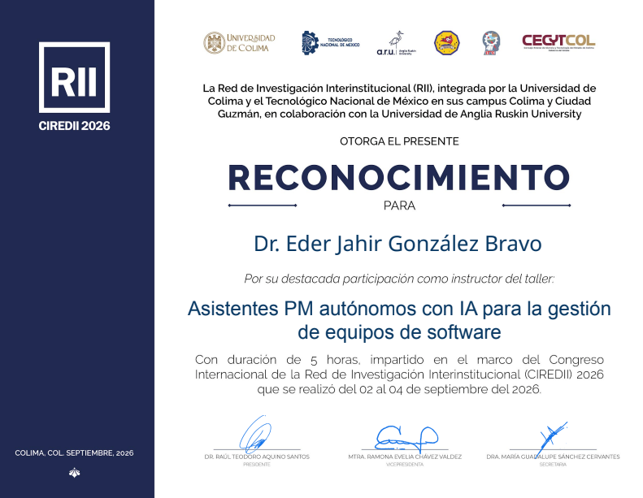
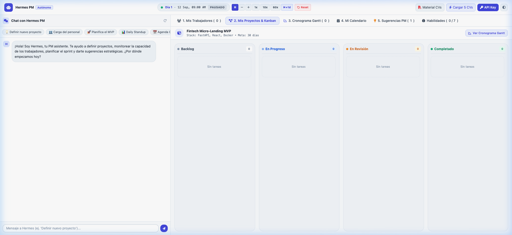
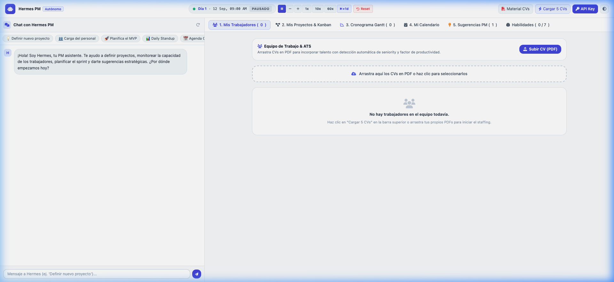
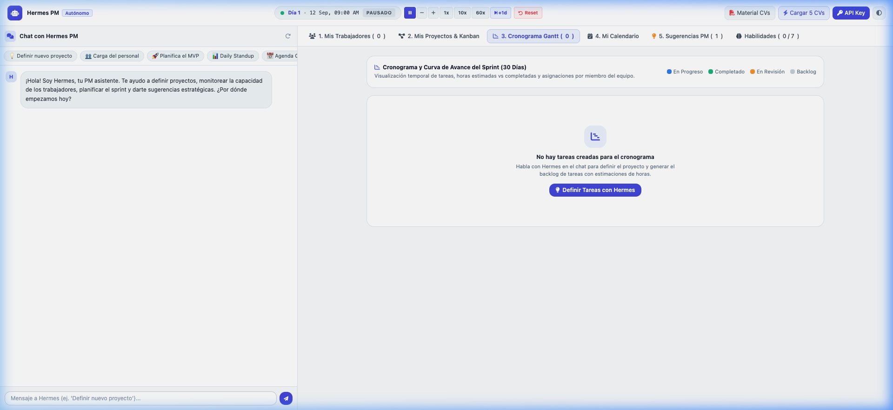
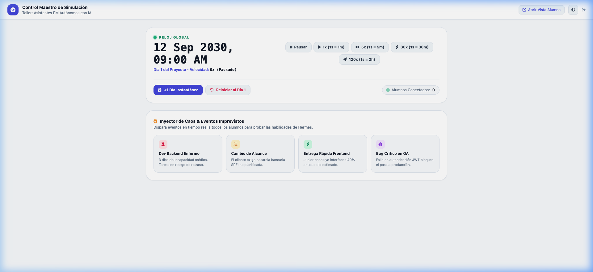

# 🤖 Hermes PM — Asistentes PM Autónomos con IA para la Gestión de Equipos de Software

> **Taller Oficial impartido en el marco del Congreso Internacional de la Red de Investigación Interinstitucional (CIREDII 2026)**  
> **Fechas y Sede:** 02 al 04 de septiembre de 2026 • Colima, Col., México  
> **Instructor:** Dr. Eder Jahir González Bravo  
> **Instituciones Convocantes:** Red de Investigación Interinstitucional (RII) • Universidad de Colima • Tecnológico Nacional de México (campus Colima y Ciudad Guzmán) • Anglia Ruskin University • CECYTCOL

---

Este repositorio contiene el paquete completo y entorno sandbox desarrollado para el taller de 5 horas titulado **«Asistentes PM autónomos con IA para la gestión de equipos de software»**.

El proyecto permite a investigadores, docentes y desarrolladores experimentar con la creación y evaluación de un asistente autónomo de gestión ágil de proyectos (**Hermes PM**), combinando interfaces reactivas, simulación temporal acelerada, evaluación de talento técnico (ATS) y llamadas a herramientas cognitivas (*ReAct / tool-calling*).

---

## 🎖️ Reconocimiento Oficial del Taller

<p align="center">
  
</p>

---

## 📸 Capturas de la Aplicación

### 1. Workspace Principal (Hermes PM, Tablero Kanban y Chat Autónomo)


### 2. Gestión de Equipo Técnico y ATS


### 3. Cronograma Gantt y Curva de Avance del Sprint


### 4. Centro de Control del Instructor (Inyección de Caos y Simulador)


---

## 🌟 Características Principales

1. **Agente Autónomo de PM (Hermes):**
   - Motor cognitivo con razonamiento paso a paso y ejecución de herramientas.
   - Apertura y refinamiento de historias de usuario, estimación de esfuerzo y desglose de tareas.
   - Asignación inteligente de tareas a desarrolladores según afinidad técnica y seniority.

2. **Simulación de Tiempo Acelerada:**
   - Motor temporal central (`clock.py`) que permite acelerar el paso del tiempo (`1x`, `10x`, `60x` o saltos de `+1 día`).
   - Permite observar en pocos minutos cómo un equipo de desarrollo avanza a lo largo de un sprint de dos semanas.

3. **ATS Técnico y Generador de CVs:**
   - Carga y procesamiento de perfiles profesionales en PDF.
   - Evaluación automática de competencias y cálculo de factores de productividad.

4. **Tablero Kanban Reactivo y Gantt Dinámico:**
   - Progresión de tareas en tiempo real (*Backlog*, *In Progress*, *Review*, *Done*) transmitida vía **Server-Sent Events (SSE)**.
   - Gráfico de Gantt y calendario ágil de ceremonias (Kickoff, Dailies, Checkpoints, Demos).

5. **Panel de Instructor (Chaos Engineering):**
   - Interfaz para el instructor (`/instructor`) con inyección de incidentes imprevistos (bloqueos, bajas de personal, cambios de alcance) para evaluar la respuesta adaptativa del agente.

6. **Doble Modo de Razonamiento:**
   - **Gemini API:** Integración directa con los modelos de Google AI Studio (`gemini-2.5-flash-lite`, `gemini-3.1-flash-lite`, `gemini-3.5-flash-lite`).
   - **Smart Fallback Local:** Motor heurístico determinista incluido que funciona 100% offline y sin costo para ejercicios en el aula.

---

## 🚀 Cómo Ejecutar el Proyecto

### Opción A: Con Docker (Recomendado)

1. Clonar el repositorio:
   ```bash
   git clone https://github.com/eder-bravo/colima.git
   cd colima
   ```

2. Iniciar con Docker Compose:
   ```bash
   docker compose up --build
   ```

3. Abre en tu navegador:
   👉 **`http://localhost:8000`** (Panel principal del alumno)  
   👉 **`http://localhost:8000/instructor`** (Panel de instructor)

---

### Opción B: Con Python Nativo

1. Crear y activar entorno virtual (Python 3.10 o superior):
   ```bash
   python3 -m venv venv
   source venv/bin/activate  # En Windows: venv\Scripts\activate
   ```

2. Instalar dependencias:
   ```bash
   pip install -r requirements.txt
   ```

3. Iniciar el servidor FastAPI:
   ```bash
   uvicorn app.main:app --host 0.0.0.0 --port 8000 --reload
   ```

4. Abrir en el navegador:
   👉 **`http://localhost:8000`**

---

## 🔑 Configuración de API Key (Opcional)

Si deseas utilizar los modelos de **Google Gemini**:
1. Obtén tu clave en [Google AI Studio](https://aistudio.google.com/app/apikey).
2. Puedes ingresarla directamente en la interfaz web mediante el botón superior **🔑 API Key** (se guarda en el `localStorage` de tu navegador).
3. O definir la variable de entorno en un archivo `.env`:
   ```env
   GEMINI_API_KEY=tu_api_key_aqui
   ```

---

## 📂 Estructura del Código

```
colima/
├── app/
│   ├── main.py              # Endpoints FastAPI y transmisión SSE
│   ├── agent.py             # Lógica del agente Hermes y loop de herramientas
│   ├── clock.py             # Motor de simulación de tiempo acelerado
│   ├── db.py                # Capa SQLite y persistencia de estado
│   ├── ats.py               # Algoritmo de scoring de CVs y perfiles
│   ├── generator_assets.py  # Generador dinámico de minutas y reportes PDF
│   └── static/              # Frontend web (HTML5, Tailwind, JavaScript)
│       ├── index.html       # Aplicación principal del alumno
│       ├── app.js           # Lógica cliente y reactividad en tiempo real
│       └── instructor.html  # Panel de inyección de incidentes
├── Dockerfile               # Imagen de contenedor basada en python:3.12-slim
├── compose.yaml             # Configuración de Docker Compose para despliegue local
├── requirements.txt         # Dependencias de Python
└── README.md                # Documentación del proyecto
```

---

## 👥 Créditos y Contexto

- **Evento:** Congreso Internacional de la Red de Investigación Interinstitucional (CIREDII 2026) — Taller de Asistentes PM Autónomos con IA.
- **Autor / Instructor:** Dr. Eder Jahir González Bravo ([@eder-bravo](https://github.com/eder-bravo)).
- **Licencia:** MIT.
